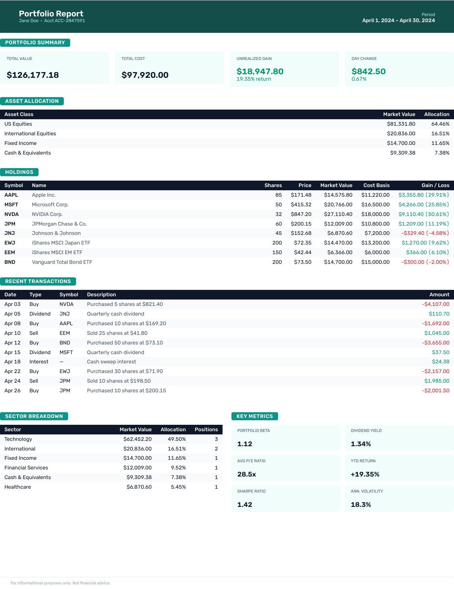

# typst-go-wasm

PDF generation from [Typst](https://typst.app) templates, running entirely in-process via WebAssembly (WASM).

No external processes, no network calls, no Typst CLI binary required.



## Installation

```sh
go get github.com/varunbpatil/typst-go-wasm@latest
```

Requires Go 1.25+. No CGo, no external binaries.

## How it works

```
caller (Go)
  │  CompileRequest{Template, Files, Data, Fonts}
  ▼
Compiler.Compile()
  │  JSON-encodes envelope {main, files, data, fonts (base64)}
  │  writes it into WASM linear memory
  ▼
typst_compiler.wasm  (Rust + typst-as-lib, compiled to WASM)
  │  decodes envelope
  │  decodes base64 fonts → TypstEngine
  │  resolves aux file imports from the files map
  │  injects data as sys.inputs
  │  compiles template → PDF bytes
  ▼
Compiler.Compile() returns []byte (PDF)
```

The WASM module is embedded in the Go binary at compile time via `//go:embed`. A single `Compiler` instance can serve concurrent requests safely — each call instantiates a fresh WASM module.

## Usage

```go
import "github.com/varunbpatil/typst-go-wasm"

compiler, err := typst.NewCompiler(ctx)
if err != nil { ... }
defer compiler.Close(ctx)

// Load fonts from disk (or embed them in your binary).
regularTTF, _ := os.ReadFile("fonts/MyFont-Regular.ttf")
boldTTF, _    := os.ReadFile("fonts/MyFont-Bold.ttf")

pdf, err := compiler.Compile(ctx, typst.CompileRequest{
    // Main .typ source.
    Template: mainTemplateContent,
    // Auxiliary files the template may #import by name.
    Files: map[string]string{
        "layout.typ": layoutTypContent,
    },
    // Any JSON-serializable value; available in the template as sys.inputs.
    Data: map[string]any{
        "title": "Hello",
        "items": []string{"a", "b", "c"},
    },
    // Raw TTF/OTF bytes. At least one font required.
    Fonts: [][]byte{regularTTF, boldTTF},
})
```

Inside the Typst template, access data via `sys.inputs`:

```typst
#set text(font: "MyFont")

#let data = sys.inputs
#data.title        // "Hello"
#data.items.at(0)  // "a"
```

## Bring your own fonts

The WASM binary contains no embedded fonts. You must supply at least one font via `CompileRequest.Fonts`; any font name referenced in a template that is not present in the provided bytes will cause a compile error.

Font bytes are sent through the JSON envelope as base64 strings (Go's `encoding/json` handles this automatically for `[][]byte`) and decoded inside WASM before the engine is built.

The repository ships three [Rubik](https://fonts.google.com/specimen/Rubik) weights (OFL license) in `fonts/` as a ready-to-use example:

```go
//go:embed fonts/Rubik-Regular.ttf
var rubikRegular []byte

//go:embed fonts/Rubik-Medium.ttf
var rubikMedium []byte

//go:embed fonts/Rubik-SemiBold.ttf
var rubikSemiBold []byte

pdf, err := compiler.Compile(ctx, typst.CompileRequest{
    ...
    Fonts: [][]byte{rubikRegular, rubikMedium, rubikSemiBold},
})
```

## Concurrency and memory

Each `Compile` call instantiates a fresh WASM module, which allocates ~48 MB of linear memory for the duration of the call. That memory is released as soon as the call returns.

Peak memory scales linearly with the number of concurrent compilations. For high-throughput services, cap concurrency with a semaphore:

```go
sem := make(chan struct{}, 8)

sem <- struct{}{}
pdf, err := compiler.Compile(ctx, req)
<-sem
```

A `Compiler` instance is safe for concurrent use — the semaphore only controls how many calls run simultaneously, not access to the `Compiler` itself.

## Rebuilding the WASM

The committed `typst_compiler.wasm` is a convenience artifact. CI verifies the Rust source compiles cleanly but does not assert the binary matches — Rust WASM builds are not reproducible across machines or toolchain versions.

The Rust source lives in `wasm/`. After modifying it:

```sh
cd wasm
CARGO_TARGET_DIR=/tmp/cargo-target cargo build --target wasm32-wasip1 --release
cp /tmp/cargo-target/wasm32-wasip1/release/typst_compiler.wasm ../typst_compiler.wasm
```

Commit both the source change and the updated `typst_compiler.wasm`.

Requires Rust stable with the `wasm32-wasip1` target:

```sh
rustup target add wasm32-wasip1
```

The committed binary was built with **rustc 1.95.0**. Using a different toolchain version will produce a functionally equivalent but byte-for-byte different binary.

## License

This project is licensed under the [MIT License](LICENSE).

The bundled Rubik fonts (`fonts/`) are licensed under the [SIL Open Font License 1.1](https://scripts.sil.org/OFL).
